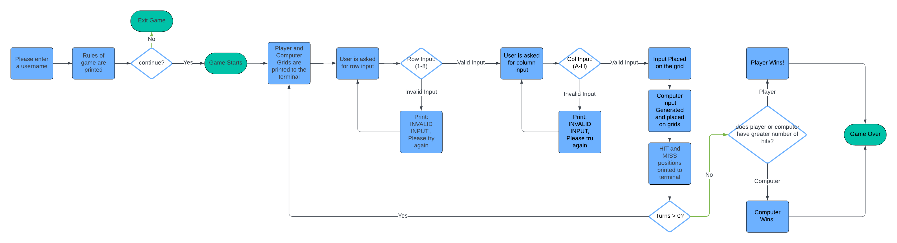
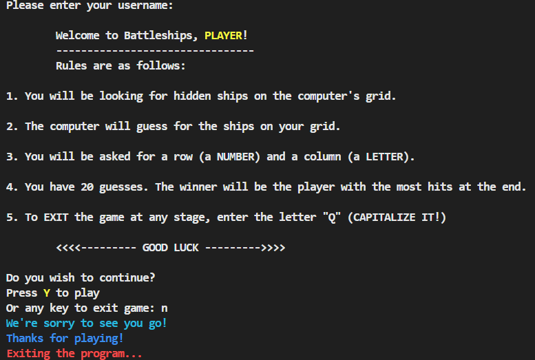
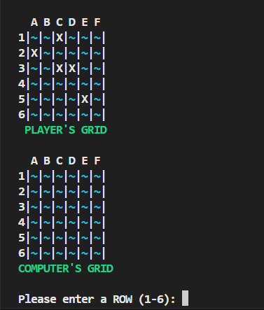

Welcome,

This is the Code Institute student template for deploying your third portfolio project, the Python command-line project. The last update to this file was: **March 14, 2023**

## Reminders

- Your code must be placed in the `run.py` file
- Your dependencies must be placed in the `requirements.txt` file
- Do not edit any of the other files or your code may not deploy properly

## Creating the Heroku app

When you create the app, you will need to add two buildpacks from the _Settings_ tab. The ordering is as follows:

1. `heroku/python`
2. `heroku/nodejs`

You must then create a _Config Var_ called `PORT`. Set this to `8000`

If you have credentials, such as in the Love Sandwiches project, you must create another _Config Var_ called `CREDS` and paste the JSON into the value field.

Connect your GitHub repository and deploy as normal.

## Constraints

The deployment terminal is set to 80 columns by 24 rows. That means that each line of text needs to be 80 characters or less otherwise it will be wrapped onto a second line.

---

Happy coding!

# Battleship Game

## Overview 
## How To Play
## Deployed Site
#### The live site can be found here : (link to site)

# Contents
* [Battleship Game](#battleship-game)
    * [Overview](#overview)
    * [How To PLay](#how-to-play)
    * [Deployed Site](#deployed-site)

* [User Experience UX](#user-experience-ux)
    * [User Stories](#user-stories)
        * [Client Goals](#client-goals)
        * [First Time Visitor Goals](#first-time-visitor-goals)
        * [Returning Visitor Goals](#returning-visitor-goals)

* [Workflow](#workflow)
    * [Flowchart](#flowchart)
    * [Wireframe](#wireframe)

* [Features](#features)
    * [Existing Features](#existing-features)
        * [Random Board Generation](#random-board-generation)
        * [Input Validation and Error Checking](#input-validation-and-error-checking)
    * [Future Features](#future-features)

* [Testing](#testing)
    * [Manual Testing](#manual-testing)
    * [Validator Testing](#validator-testing)
    * [Lighthouse Testing](#lighthouse-testing)
    * [Bugs](#bugs)
        * [Fixed Bugs](#fixed-bugs)
        * [KNown Bugs](#known-bugs)

* [Deployment](#deployment)
    * [Github](#github)
    * [Heroku](#heroku)
    * [How to Clone](#how-to-clone)

* [Technologies Used](#technologies-used)
* [Languages Used](#languages-used)
* [Frameworks Libraries and Programs Used](#frameworks-libraries--programs-used)

* [Credits](#credits)
    * [Code](#code)
    * [Content](#content)
    * [Media](#media)
    * [Acknowledgments](#acknowledgements)

# User Experience (UX)
## User Stories
#### Client goals

* The user should be able to play the game without any prior knowledge of the game

#### First-time visitor goals
* I want to find out how the game works
* I want to win against the computer
* I want to be able to exit the game when I don't want to play anymore

#### Returning Visitor Goals
* I want to win against the computer
* I want to be able to exit the game when I don't want to play anymore

# Workflow
 
## Flowchart
#### Lucid Chart

## Wireframe 
 wireframe sketches screenshots (function planning etc)

# Features
## Existing Features
### Game Start
1. Player is asked to input their username, a user has an option to leave this option blank and is assigned 'Player' as their username for the rules section, and the player grid's label. 
2. A welcome message and rules for the game are printed in a list format, outlining the rules of the game and how to play.
3. A user is asked if they wish to continue.
4. If they press 'y' the game starts, if they wish to exit, they can press 'n' or any other character.
5. The player and computer boards are then printed to the terminal.

 

### Random Board Generation
1. The player's grid is printed to the board.
2. Five ships are placed randomly on the board, these are the ships for the computer to guess. 
3. The computer's grid is printed to the terminal with no visible ships. This is for the player to guess ship positions using row and column inputs.
4. A hidden board is created with random ship positions generated. The user guesses for positions on the hidden board and will be marked with hit and miss symbols on the computer's grid.

### Input Validation and Error Checking
1. Row and column inputs are validated, if an invalid input is entered then the user will be asked for the input again, until it is valid. (In this verion, rows = 1 - 6, columns = A - F).
2. If a user puts a letter in the row input, or a number in the column input there will be an error message printed, with instructions for the correct input. 
3. Equally, if multiple numbers or letters or no input is entered then the message will also display. 
4. If a user enters a capital letter "z" they will exit the program.

## Future Features
* I would have liked to include an option for a user to select their own grid size, as well as to select the number of ships and the positions of each ship. I started to include these features but struggled with writing the functions with the time I had remaining.

 

# Testing 

## Manual Testing
 manual testing grids (screenshot)
## Validator Testing
CI Python Linter Validator.
## Lighthouse Testing
screenshot of DEPLOYED lighthouse test
## Bugs
### Fixed Bugs
### Known Bugs

# Deployment 
The game is designed to be played locally in a terminal environment. It can be run by executing the Python script run.py.  

### Github
1. Login (or sign up) to Github.
2. Find the repository for this project, Code-Institute-Projekt-3-PYTHON-battleship.
3. Click on the Settings link.
4. Click on the Pages link in the left-hand side navigation bar.
5. In the Source section, choose main from the drop-down select branch menu. Select Root from the drop-down select folder menu.
6. Click Save. Your live Github Pages site is now deployed at the URL shown.cal machine.

### Heroku

The deployment is made using [Heroku](https://www.heroku.com/) following the listed steps:

1. Log in or register a new account on Heroku
2. Click on 'New' in the dashboard and select 'Create New App'
3. Select a name for the app and choose your region.
4. Click on "Create app"
5. When the app is created click on Setting
6. To improve compatibility with various Python libraries add Config Var with Key = PORT and the Value = 8000
7. Add 2 buildpacks: Python and then Nodejs in this specific order 
8. Go back at the top and click on "Deploy" and select "GitHub"
9. Scroll down and click on 'Connect to GitHub'
10. Search for your GitHub repository name by typing it
11. Click on "Connect"
12. Scroll down and click on "Deploy Branch"
13. You will see a message "The app was successfully deployed" when the app is built with python and all the depencencies
14. Click on view and you will see the deployed site

#### How to Clone

1. Login (or sign up) to GitHub.
2. Go to the repository for this project, it can be found here (link)
3. Click on the code button, select whether you would like to clone with HTTPS, SSH, or GitHub CLI, and copy the link shown.
4. Open the terminal in your code editor and change the current working directory to the location you want to use for the cloned directory.
5. Type 'git clone' into the terminal and then paste the link you copied in step 3. Press enter.

## Technologies Used

* Python: The programming language used to build the game logic.

## Languages Used

* Python: The main language used for programming the game.

## Frameworks, Libraries & Programs Used

* Visual Studio Code: The code editor used for development.
* Git & GitHub: Used for version control and project collaboration.
* Github - To save and store the files.
* Heroku for final deployment.
* Apple Notes app for project structure and planning
* Lucid Charts for flow chart

# Credits
## Code
## Content
## Media
## Acknowledgements 