# Battleship Game

## Overview 

A simple battleships game where a user plays against the computer to try and hit the most battleships with 20 turns.

Portfolio Project 3 - Python.

## How To Play

* User is presented with an empty board, and has to guess positions on the board to hit hidden ships.
* User is playing against the computer, so the computer has its own grid to guess and will generate random numbers to try and hit the ships.
* The computer will take a turn when a user has put in two inputs, row (a number) and column (a letter), and either hits or misses the positon.
* The user has 20 turns to take, whoever has the most hits by the end of the game is the winner. If all ships are hit before the turns are up, then the game will end and the winner and results will be printed.

Rules can also be found here: [Battleship (Game) - Wikipedia ](https://en.wikipedia.org/wiki/Battleship_(game))

## Deployed Site

#### The live site can be found here : [Battleship Game](https://battleship-fvr-8678a5bba0bf.herokuapp.com/)

# Contents
* [Battleship Game](#battleship-game)
    * [Overview](#overview)
    * [How To PLay](#how-to-play)
    * [Deployed Site](#deployed-site)

* [User Experience UX](#user-experience-ux)
    * [User Stories](#user-stories)
        * [Client Goals](#client-goals)
        * [First Time Visitor Goals](#first-time-visitor-goals)
        * [Returning Visitor Goals](#returning-visitor-goals)

* [Workflow](#workflow)
    * [Flowchart](#flowchart)
    * [Wireframe](#wireframe)

* [Features](#features)
    * [Existing Features](#existing-features)
        * [Game Start](#game-start)
        * [Random Board Generation](#random-board-generation)
        * [Input Validation and Error Checking](#input-validation-and-error-checking)
        * [Gameplay Mechanics](#gameplay-mechanics)
        * [End of Game](#end-of-game)
    * [Future Features](#future-features)

* [Testing](#testing)
    * [Manual Testing](#manual-testing)
    * [Validator Testing](#validator-testing)
    * [Lighthouse Testing](#lighthouse-testing)
    * [Bugs](#bugs)
        * [Fixed Bugs](#fixed-bugs)
        * [Known Bugs](#known-bugs)

* [Deployment](#deployment)
    * [Github](#github)
    * [Heroku](#heroku)
    * [How to Clone](#how-to-clone)

* [Technologies Used](#technologies-used)
    * [Languages Used](#languages-used)
    * [Frameworks Libraries and Programs Used](#frameworks-libraries--programs-used)

* [Credits](#credits)
    
* [Acknowledgments](#acknowledgements)

# User Experience (UX)
## User Stories
#### Client goals

* The user should be able to play the game without any prior knowledge of the game

#### First-time visitor goals
* I want to find out how the game works
* I want to win against the computer
* I want to be able to exit the game when I don't want to play anymore

#### Returning Visitor Goals
* I want to win against the computer
* I want to be able to exit the game when I don't want to play anymore

# Workflow
 
## Flowchart

#### Lucid Chart

## Wireframe 

I used my notes app on my iPad for planning functions as well as mapping out the board with hit and miss symbols to demonstrate what I wanted it to look like. I had a general idea of some of the functions and how they would operate in the game. 

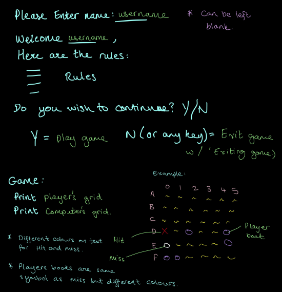
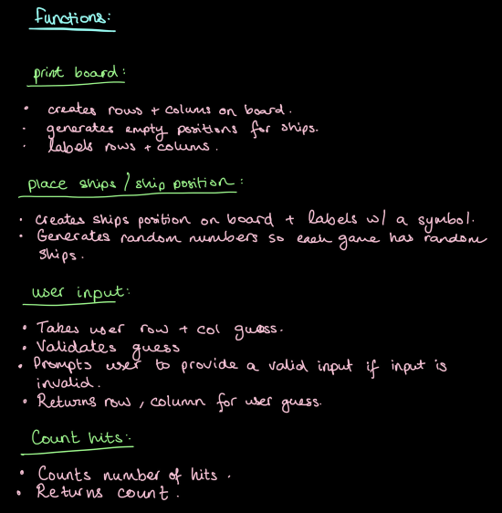
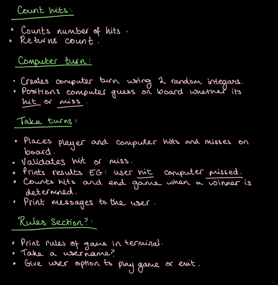

# Features

## Existing Features

### Game Start

1. Player is asked to input their username, a user has an option to leave this option blank and is assigned 'Player' as their username for the rules section, and the player grid's label. 
2. A welcome message and rules for the game are printed in a list format, outlining the rules of the game and how to play.
3. A user is asked if they wish to continue.
4. If they press 'y' the game starts, if they wish to exit, they can press 'n' or any other character.
5. The player and computer boards are then printed to the terminal.

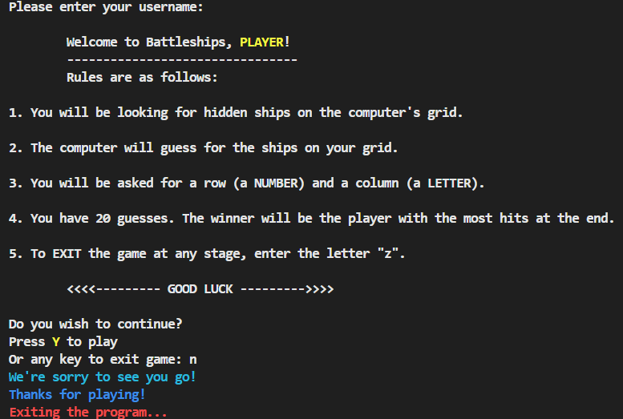 

### Random Board Generation
1. The player's grid is printed to the board.
2. Five ships are placed randomly on the board, these are the ships for the computer to guess. 
3. The computer's grid is printed to the terminal with no visible ships. This is for the player to guess ship positions using row and column inputs.
4. A hidden board is created with random ship positions generated. The user guesses for positions on the hidden board and will be marked with hit and miss symbols on the computer's grid.

### Input Validation and Error Checking
1. Row and column inputs are validated, if an invalid input is entered then the user will be asked for the input again, until it is valid. (In this verion, rows = 1 - 6, columns = A - F).
2. If a user puts a letter in the row input, or a number in the column input there will be an error message printed, with instructions for the correct input. 
3. Equally, if multiple numbers or letters or no input is entered then the message will also display. 
4. If a user enters letter "z" they will exit the program.

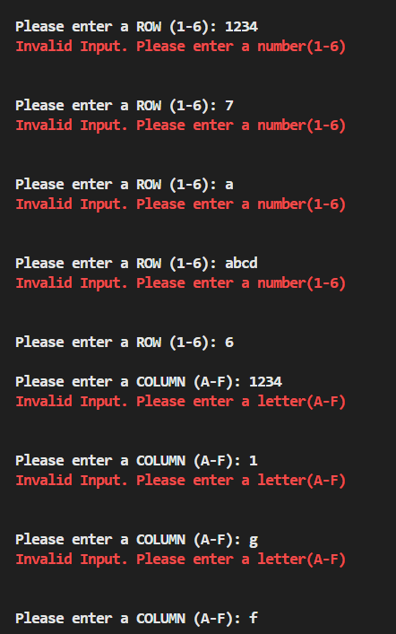
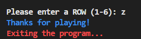

### Gameplay Mechanics

1. The user is given 20 turns to get as many hits as possible.
2. The computer turn is taken after the user has given their valid inputs. The computer turn is generating two random integars between 0 and the set grid size, and then placed on the board. If the computer generates the same two numbers more than once, it will run again until a unique combination is found. 
3. After the guesses are made, the hit and miss symbols are placed on the board.
4. A message is printed to the terminal with results of the guesses, whether the player or computer have a hit or miss.
5. Another message is displayed below that, letting the user know how many turns are left. The number of turns decreases as each turn is taken. 
6. The new grids are printed with the positions of hits and miss symbols on the board.
7. The game will end if user or computer guesses all the ships on their guess board, regardless of how many turns are left.

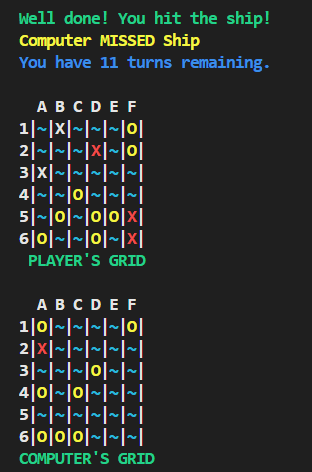
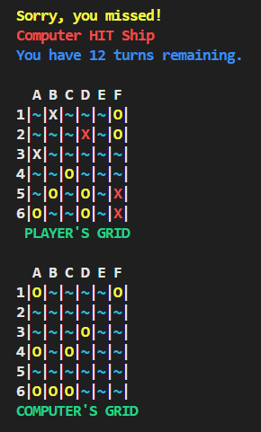

### End of Game 

1. When all ships are hit, a message will be printed to the terminal letting the user know the winner of the game and then exits the game.
2. If the turns run out and not all the ships are hit, a message is printed to say the winner and how many hits they have.
3. If both computer and user score the same then the score and a message saying its a tie will be printed.
4. The final game boards are printed to the terminal below the message, as well as a "GAME OVER" message.

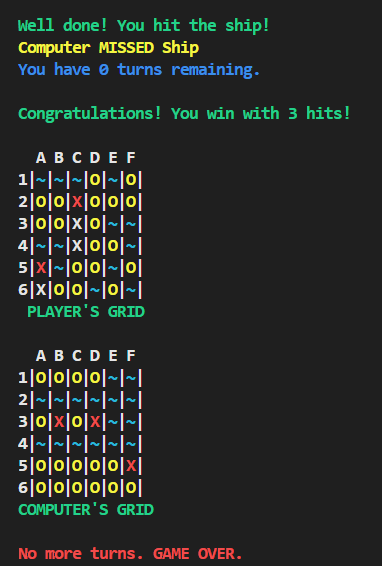
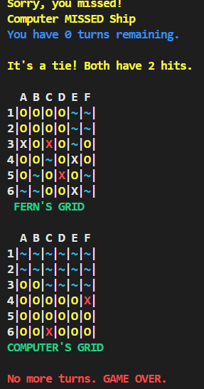

## Future Features

* I would have liked to include an option for a user to select their own grid size, as well as to select the number of ships and the positions of each ship. I started to include these features but struggled with writing the functions with the time I had remaining.
* I want to include a feature to ask if the user wants to do a single player game, or play against the computer. The single game player would just be a user guessing on a hidden grid and no computer grid or turns. The user would have 10 or 15 guesses (depending on the selected grid size), and have to try guess all the ships.

# Testing 

## Manual Testing

* I thoroughly tested the program during the process of writing it. I started with a single player version and then later added the computer grid and computer turns. I added the sections part by part and would run through the game to make sure the inputs were still being added and placed on the board correctly. 

* I used a test.py document in my respository, where I essentially kept my up to date code and would add stuff and test it in that folder before adding to the main python run.py folder. I found this helpful as I sometimes could get confused when adding a lot of stuff at once, it was just a bit easier to organise in having a test file where I could try anything I wanted and make notes of what worked and what didn't as well as why. I have since removed the test and notes file from this repository.

* I created a testing grid on my iPad Pro so I could test each part of the game as I added each section, ensuring each section was thoroughly tested before deciding to keep it in the program. 

* I deployed my project early in the process, before adding any code, and made sure to thoroughly test the deployed versions to ensure that everything was correct.

* Testing was performed on Visual Studio Code Terminal.

Feature | Test | Expected Outcome | Result
--- | --- | --- | ---
Username | Enter username | Username is printed to rules section and grid | Pass
Username - Empty Input | Enter empty username | "Player" is printed in place of username | Pass
Rules Input | Enter "Y" to continue to game | Game starts | Pass
Rules Input | Enter "N" or any key to exit game | Exits program | Pass
Print Grids | Start game | Player Grid and Computer Grids printed correctly | Pass
Print hidden grid | use print board function to print hidden answer board | Ships have been randomly placed correctly and are different to player's ships | Pass
Input Validation ROW | Enter incorrect data to ROW input (a, abc, 1234, empty input) | Prints "Invalid input" message and asks for correct input, repeats until correct input is entered | Pass
Input Validation COLUMN | Enter incorrect data to COL input (1, 123, abcd, empty input) | Prints "Invalid input" message and asks for correct input, repeats until correct input is entered | Pass
Exit Game - Row Input | Exiting game using "z" | The program stops running when entered | Pass
Exit Game - Column Input | Exiting game using "z" | The program stops running when entered | Pass
Progress Messages | score hit / miss and let computer take turn | Player hit/miss message prints to terminal, Computer hit/ miss message prints below it, Number of turns message prints | Pass
Turns | Enter inputs | Turns message decreases number of turns with each turn taken | Pass
End of Game | Enter inputs until turns = 0 | Winner and result are printed to terminal and exits program | Pass
End of Game - User/Computer hits all | Print "test" answer grid with other grids and correctly get all the hits before turns run out | Winner will be printed with congratulations message to terminal and exit game | Pass

## Validator Testing

#### CI Python Linter Validator

* After removing whitespace and fixing the length of the lines, I encountered one error stating not to use a lambda and use def instead. I tried to use def but encountered some errors, so decided to keep it with lambda as it was working. I would probably change it to def if I had a bit more time to try different ways of writing it.

  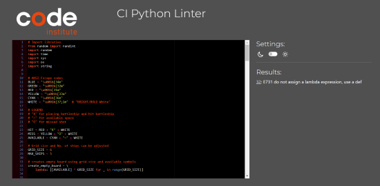

## Lighthouse Testing

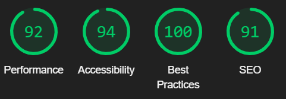

## Bugs

### Fixed Bugs

* One of my biggest issues was getting the input validations correct, I tried many different ways of executing the code which all had small issues. I solved this with a try and except statement, but would like to find a better way to write the row input values without having a list. For the column input section I have BOARD_ROW_TO_COLUMNS_MAP.keys() which makes it adjustible to the grid size, as opposed to the list of letters. I couldn't get it to work on the row input another way without spending too much time.

* I had some issues using the 'break' keyword in some sections, so I created an exit game function to exit the program when its called and this solved the issues.

* I fixed a lot of spelling and syntax issues throughout the project, mostly solved through the messages in the terminal or using the python validator to easily identify what was causing issues.

### Known Bugs

* I had issues trying to create a grid input option for a user. I tried to make the code to include the grid_size variable that can be changed and I can succesfully create the grids of different sizes by adjusting the number on the grid_size variable. My issues came with the user input in changing the grid size, and I couldn't find a way to implement it without errors, for this reason I didn't include the option and set the grid size to 6 to be well readible in the deployed terminal. 

* During the game, if a user inputs the same inputs twice, the user is notified, but the computer still takes a turn when the user essentially loses a turn. I tried a few different ways to change the play_game function, or creating other functions to solve this issue but it would throw errors with the input validation and I couldn't figure out a way to fix this. I decided to not decrement the user turn here but would like to find a way to prevent the computer from taking a turn here. 

# Deployment 

The game is designed to be played locally in a terminal environment. It can be run by executing the Python script run.py.  

### Github
1. Login (or sign up) to Github.
2. Find the repository for this project, Code-Institute-Projekt-3-PYTHON-battleship.
3. Click on the Settings link.
4. Click on the Pages link in the left-hand side navigation bar.
5. In the Source section, choose main from the drop-down select branch menu. Select Root from the drop-down select folder menu.
6. Click Save. Your live Github Pages site is now deployed at the URL shown.cal machine.

### Heroku

The deployment is made using [Heroku](https://www.heroku.com/) following the listed steps:

1. Log in or register a new account on Heroku
2. Click on 'New' in the dashboard and select 'Create New App'
3. Select a name for the app and choose your region.
4. Click on "Create app"
5. When the app is created click on Setting
6. To improve compatibility with various Python libraries add Config Var with Key = PORT and the Value = 8000
7. Add 2 buildpacks: Python and then Nodejs in this specific order 
8. Go back at the top and click on "Deploy" and select "GitHub"
9. Scroll down and click on 'Connect to GitHub'
10. Search for your GitHub repository name by typing it
11. Click on "Connect"
12. Scroll down and click on "Deploy Branch"
13. You will see a message "The app was successfully deployed" when the app is built with python and all the depencencies
14. Click on view and you will see the deployed site

#### How to Clone

1. Login (or sign up) to GitHub.
2. Go to the repository for this project, it can be found here (link)
3. Click on the code button, select whether you would like to clone with HTTPS, SSH, or GitHub CLI, and copy the link shown.
4. Open the terminal in your code editor and change the current working directory to the location you want to use for the cloned directory.
5. Type 'git clone' into the terminal and then paste the link you copied in step 3. Press enter.

# Technologies Used

## Languages Used

* Python used to write script [Python](https://www.python.org/doc/)

## Frameworks, Libraries & Programs Used

1. [Visual Studio Code](https://code.visualstudio.com/)
    - I used Visual Studio Code as editor for this project.

1. [GitPod:](https://www.gitpod.io/)
    - I used GitPod as my editor for this project.

1. [Git](https://git-scm.com/)
    - Git was used for version control by utilizing the Gitpod terminal to commit to Git and Push to GitHub.

1. [GitHub:](https://github.com/)
    - GitHub is used to store the projects code after being pushed from Git.

1. [Python Tutor Visual Debugger:](https://pythontutor.com/)
    - I sometimes used Python Tutor for debugging.

1. [Heroku:](https://heroku.com)
    - For final deoployment.

1. [Notes:](https://apple.com/notes/)
    - I used the apple notes app on both my iPad and my iPhone for sketches, or any other planning/checklists used for this project.

1. [Lucid Charts:](https://apple.com/notes/)
    - I used Lucid Charts to create a flowchart when planning my project.

1. [Apple Numbers:](https://apple.com/numbers/)
    - I used the Numbers app on my iPad pro to create testing spreadsheets.

# Credits

* [W3Schools](https://www.w3schools.com/), [PEP 8 Style Guide]( https://peps.python.org/pep-0008/), [OverAPI](https://overapi.com/python), [Haoyi's Programming Blog](https://www.lihaoyi.com/) provided a lot of my documentation and reading materials for being able to practise python coding and readability.

* Youtube video from [Knowledge Mavens Channel](https://www.youtube.com/watch?v=tF1WRCrd_HQ) was used as refernce for game logic and structure.

## Acknowledgements 

* Code Institute and its amazing Slack community for their support and providing me with the necessary knowledge to complete this project.

* My mentor Sandeep, for providing a lot of knowledge, guidance and very helpful reading materials.

[Back To Top](#battleship-game)